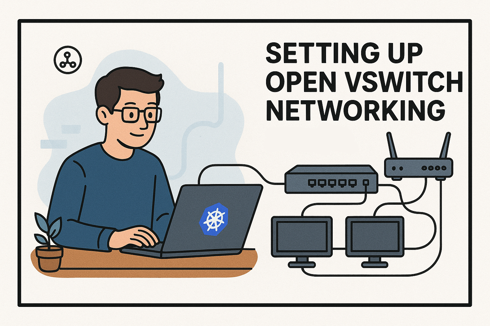

# Part 1:  Setting up OpenvSwitch Networking



This article series documents my interest creating a Kubernetes "home-lab" for research and experiementation. It will consist of a mix of virtual machines running the Kubernetes control plan and a standalone front end load balancer.

When running virtual machines or containers on a Linux host, networking is often the trickiest piece to get right. The default Linux bridge works fine for basic setups, but if you want advanced features like VLAN tagging, tunneling, quality of service, or integration with SDN tools, you quickly run into its limits. That’s where Open vSwitch (OVS)comes in.

Open vSwitch is a production-grade, feature-rich virtual switch designed to bring cloud-style networking to individual servers. It’s the same technology used in OpenStack, Kubernetes, and large-scale datacenter fabrics. By connecting your physical NIC through an OVS bridge, you gain a flexible foundation for attaching VMs and containers with precise control over VLANs and traffic policies.

Another key benefit is support for LLDP (Link Layer Discovery Protocol). Enabling LLDP means your hypervisor can automatically advertise its presence and network role to the upstream switch, making it much easier to visualize topologies, verify VLAN assignments, and debug connectivity issues. In environments where automation and visibility matter, LLDP is invaluable. In my home network, I can see LLDP in action with my Ubiquity Unifi Router.

The procedure below walks through setting up an OVS bridge on Ubuntu 24.04 Desktop using a single physical NIC. I'll also show how to configure LLDP so your host properly participates in layer-2 discovery. The end result is a clean, robust virtual networking setup where your host’s IP lives on the OVS bridge, VMs can be mapped to the right VLANs, and your physical switch can “see” exactly how everything is wired.

Note that these instructions are verbose, with multiple reboots that are not required but help confirm everything is setting up and working correctly.

## Step1: Install open vSwitch
```bash
$ sudo apt update
$ sudo apt install -y openvswitch-switch qemu-kvm libvirt-daemon-system virt-manager
```

## Step 2: Stop NetworkManager from managing our NIC
By default, the desktop install of Ubuntu 24.04 uses NetworkManager to manage NIC settings, but I wanted to override this behavior.  I used the desktop version of Ubuntu because I still wanted the convienence of a graphical user interface for home usages. My local NIC was exposed as enp1s0 so that is referenced below.
```bash 
$ sudo mkdir -p /etc/NetworkManager/conf.d
$ sudo tee /etc/NetworkManager/conf.d/10-unmanaged-enp1s0.conf >/dev/null <<'EOF'
[keyfile]
unmanaged-devices=interface-name:enp1s0
EOF
sudo systemctl restart NetworkManager
```

## Step 3: Create Netplan file that defines an OVS bridge 
Now that I've stopped NetworkManager, I create a replacement netplan that defines a OpenVSwith.
```bash
sudo tee /etc/netplan/01-ovs.yaml >/dev/null <<'YAML'
network:
  version: 2
  renderer: networkd

  ethernets:
    enp1s0: {}

  bridges:
    br0:
      openvswitch: {}        # <-- THIS makes it an OVS bridge
      interfaces: [enp1s0]   # enp1s0 becomes an OVS port
      dhcp4: true            # or replace with addresses: [...] / routes: [...]
      # example static:
      # addresses: [192.168.1.50/24]
      # routes:
      #   - to: 0.0.0.0/0
      #     via: 192.168.1.1
      # nameservers:
      #   addresses: [1.1.1.1,8.8.8.8]
YAML
```

I then generate the netplan and enable openvswitch.  
```bash
$ sudo netplan generate
$ sudo netplan apply
$ sudo systemctl enable --now openvswitch-switch && sudo reboot
```

## Step 4: Install LLDP Daemon
Now that we have rebooted, I install the LLDP Daemon [information](https://en.wikipedia.org/wiki/Link_Layer_Discovery_Protocol) which broadcasts internal OpenVSwitch topology to our external router and network tools.  
```bash
$ sudo apt install -y lldpd
```

I now enable LLDP in OVS, globally on the bridge
```bash
$ sudo ovs-vsctl set Interface enp1s0 other-config:lldp=true
$ sudo ovs-vsctl set bridge br0 other-config:lldp-enable=true
```

I now create some metadata and information that will be used as part of our broadcasts
```bash
sudo vi /etc/lldpd.d/custom.conf
configure system description "Ubuntu 24.04 Host with OVS"
configure system hostname "hypervisor01"
sudo systemctl enable --now lldpd && sudo reboot
```

## Step 5: Verify everything after reboot
After our final reboot, the following commands help ensure everything is working correclty with our new Open vSwitch bridge and LLDP.
```bash
# OVS view
sudo ovs-vsctl show

# Kernel view: should NOT show "bridge ..." attributes anymore for br0
ip -d link show br0

# IP should live on br0
ip a show br0

# Verify LLDP
sudo ovs-vsctl list Interface enp1s0 | grep lldp
sudo lldpcli show neighbors
```

# Wrapping Up

By the end of this procedure, your Ubuntu 24.04 host is running on a clean, fully integrated Open vSwitch bridge with your NIC handed off properly, your host IP bound to the bridge instead of the physical interface, and LLDP enabled so the upstream switch can automatically discover and map your server.

This setup gives you a strong foundation for modern virtualization and container workloads:
	• Flexibility to attach VMs or containers with VLAN tags or trunks.
	• Visibility into your network fabric thanks to LLDP neighbor discovery.
	• Scalability to grow from a simple desktop lab into production-grade environments.

Whether you’re experimenting with virtual networks at home or building a multi-node cluster, these steps align your host with the same best practices used in datacenters and cloud platforms. The result is a network stack that’s easier to manage, easier to debug, and ready for the next layer of automation.

