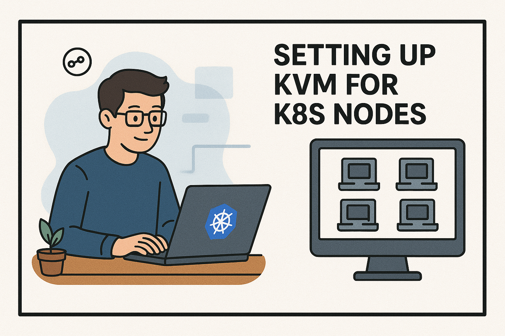
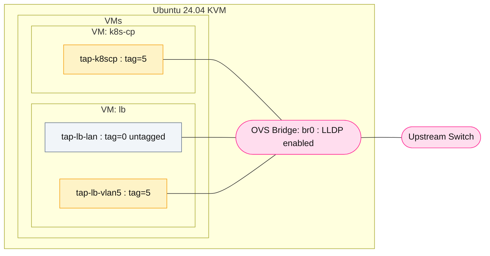

# Part 2: Setting up KVM for k8s nodes and load balancer



In Part 1, we set up Open vSwitch (OVS) on Ubuntu 24.04, moved the host’s NIC into a proper OVS bridge, and enabled LLDP so our upstream switch can see the hypervisor. This gave us a clean, flexible foundation for VM networking.

But for real-world workloads, it’s not enough to just connect VMs to the bridge. We usually need to:
* Give some VMs access to the default LAN (untagged traffic).
* Restrict others to a specific VLAN (e.g. VLAN 5 for a test network).
* Allow advanced cases where a VM gets a trunk port and manages VLANs itself.

Open vSwitch supports all of these via port tagging and trunking. Instead of running manual 'ovs-vsctl set port' commands each time a VM starts, I’ll use libvirt hooks to automatically apply the right OVS config when the VM boots and clean it up when the VM shuts down.

This this article I walk through the steps to create a KVM virtual machine for our k8s control plane, and another for our load balancer fully integrated into the VLANs I mention above. k8s can be complicated to setup, so while I refer to k8s generically this tutorial will actually leverage the easier to use k3s from [Rancher](https://www.rancher.com/products/k3s)

I'll assume you have a host with 64 GB RAM, plenty of cpu cores, and already set up Open vSwitch bridge from Part 1. . It is also important to note that these configurations are not production-ready for security, but instead configured for easy home exploration and access.



## Step 1: Download and initialize cloud image to be used as base image for our virtual machines
We will use this as the base image for all of our virtual machines.  
```bash
mkdir -p ~/vms/images ~/vms/cloudinit
cd ~/vms/images
wget https://cloud-images.ubuntu.com/noble/current/noble-server-cloudimg-amd64.img
sudo mv noble-server-cloudimg-amd64.img /var/lib/libvirt/images/
sudo chown libvirt-qemu:kvm /var/lib/libvirt/images/noble-server-cloudimg-amd64.img
sudo chmod 640 /var/lib/libvirt/images/noble-server-cloudimg-amd64.img
```

## Step 2: Create our virtual machine file systems as overlay of the base image
Each virtual machine will use an overlay file system on top of this base image, to efficiently store only the differences.  Our appllications will not be primarily I/O bound so this overlay is okay for our home lab.
```bash
sudo qemu-img create -f qcow2 -F qcow2 \
  -b /var/lib/libvirt/images/noble-server-cloudimg-amd64.img \
  /var/lib/libvirt/images/k8s-cp.qcow2 40G

sudo qemu-img create -f qcow2 -F qcow2 \
  -b /var/lib/libvirt/images/noble-server-cloudimg-amd64.img \
  /var/lib/libvirt/images/lb.qcow2 20G
```

## Step 3: Create our cloud init YAML file used to configure our k8s VM
This is the cloud init file used to customize our k8s VM. Replace <your public key here> with your actual SSH public key.  It creates this virtual machine with a single static IP on our Kubernetes VLAN at 192.168.6.10/24. Note that this configuration sets a default root password for easy access to the console: this of course is not appropriate for a production network :)
```bash
tee ~/vms/cloudinit/k8s-cp-user-data.yaml >/dev/null <<'EOF'
#cloud-config
hostname: k8s-cp
ssh_pwauth: true
disable_root: false

users:
  - name: ubuntu
    groups: sudo
    shell: /bin/bash
    sudo: ALL=(ALL) NOPASSWD:ALL
    lock_passwd: false
    ssh_authorized_keys:
      - ssh-rsa AAA <your public key here>
  - name: root
    lock_passwd: false
    shell: /bin/bash

package_update: true
package_upgrade: true
packages:
  - curl
  - qemu-guest-agent

bootcmd:
  - sed -i 's/^GRUB_CMDLINE_LINUX=.*/GRUB_CMDLINE_LINUX="console=tty1 console=ttyS0,115200n8"/' /etc/default/grub
  - update-grub
  - systemctl enable serial-getty@ttyS0.service

chpasswd:
  expire: false
  list: |
    root:changeme123

write_files:
  - path: /etc/cloud/cloud.cfg.d/99-disable-network-config.cfg
    permissions: '0644'
    owner: root:root
    content: |
      network: {config: disabled}

  - path: /etc/netplan/01-netcfg.yaml
    permissions: '0600'
    owner: root:root
    content: |
      network:
        version: 2
        ethernets:
          enp1s0:
            dhcp4: false
            dhcp6: false
            addresses: [192.168.6.10/24]
            nameservers:
              addresses: [192.168.6.1,1.1.1.1]
            routes:
              - to: 0.0.0.0/0
                via: 192.168.6.1

  - path: /etc/rancher/k3s/config.yaml
    permissions: '0644'
    content: |
      cluster-init: true
      node-ip: 192.168.6.10
      advertise-address: 192.168.6.10
      bind-address: 192.168.6.10
      tls-san:
        - 192.168.6.10     # control-plane
        - 192.168.6.11     # HAProxy VIP (VLAN5)
        - 192.168.1.30     # Public/LAN IP (extra SAN)
        - homelab.tecnovelty.net

runcmd:
  - rm -f /etc/netplan/50-cloud-init.yaml
  - netplan generate
  - netplan apply
  - systemctl enable --now qemu-guest-agent
  - curl -sfL https://get.k3s.io | sh -
EOF

sudo cloud-localds /var/lib/libvirt/images/k8s-cp-seed.iso ~/vms/cloudinit/k8s-cp-user-data.yaml
```

## Step 4: Create our cloud init YAML file used to configure our Load balancer VM
Like step 3, his is the cloud init file used to customize our load balancer VM. Replace <your public key here> with your actual SSH public key.  It creates this virtual machine with a two static IPs: 192.168.1.30/24 on our untagged 'public' network, and on our Kubernetes VLAN at 192.168.6.11/24. Note that this configuration sets a default root password for easy access to the console: this of course is not appropriate for a production network :)
```bash
tee ~/vms/cloudinit/lb-user-data.yaml >/dev/null <<'EOF'
#cloud-config
hostname: lb
ssh_pwauth: true
disable_root: false

users:
  - name: ubuntu
    groups: sudo
    shell: /bin/bash
    sudo: ALL=(ALL) NOPASSWD:ALL
    lock_passwd: false
    ssh_authorized_keys:
      - ssh-rsa AAA <your public key here>
  - name: root
    lock_passwd: false
    shell: /bin/bash

package_update: true
package_upgrade: true
packages:
  - qemu-guest-agent
  - haproxy

bootcmd:
  - sed -i 's/^GRUB_CMDLINE_LINUX=.*/GRUB_CMDLINE_LINUX="console=tty1 console=ttyS0,115200n8"/' /etc/default/grub
  - update-grub
  - systemctl enable serial-getty@ttyS0.service

chpasswd:
  expire: false
  list: |
    root:changeme123

write_files:
  - path: /etc/cloud/cloud.cfg.d/99-disable-network-config.cfg
    permissions: '0644'
    owner: root:root
    content: |
      network: {config: disabled}

  - path: /etc/netplan/01-netcfg.yaml
    permissions: '0600'
    owner: root:root
    content: |
      network:
        version: 2
        ethernets:
          enp1s0:
            dhcp4: false
            dhcp6: false
            addresses: [192.168.1.30/24]
            nameservers:
              addresses: [192.168.1.1,1.1.1.1]
            routes:
              - to: 0.0.0.0/0
                via: 192.168.1.1
          enp2s0:
            dhcp4: false
            dhcp6: false
            addresses: [192.168.6.11/24]

  - path: /etc/haproxy/haproxy.cfg
    permissions: '0644'
    owner: root:root
    content: |
      global
        maxconn 2000
        log /dev/log local0
      defaults
        log     global
        option  tcplog
        timeout connect 10s
        timeout client  1m
        timeout server  1m
      frontend k8s_api
        bind :6443
        default_backend k8s_masters
      backend k8s_masters
        balance roundrobin
        server k8s-cp 192.168.6.10:6443 check

runcmd:
  - rm -f /etc/netplan/50-cloud-init.yaml
  - netplan generate
  - netplan apply
  - systemctl daemon-reload
  - systemctl enable --now qemu-guest-agent
  - systemctl enable --now haproxy
EOF

sudo cloud-localds /var/lib/libvirt/images/lb-seed.iso     ~/vms/cloudinit/lb-user-data.yaml
```

## Step 5: Create our VM Open vSwitch network policies
These two configuration files are used to setup Open vSwitch network VLAN tag configuration.  They are access by the libvirt script below in step 6.
```bash
sudo mkdir -p /etc/libvirt/hooks/ovs
sudo tee /etc/libvirt/hooks/ovs/k8s-cp.conf >/dev/null <<'EOF'
tap-k8scp tag 5
EOF

sudo tee /etc/libvirt/hooks/ovs/lb.conf >/dev/null <<'EOF'
tap-lb-vlan5 tag 5
EOF
```

## Step 6: Create our libvirt OVS hook used for the policies above
This is the libvirt hook to manage our Open vSwitch configurations based on the virtual machine name.  It looks for a configuration file matching the virtual name and setups up or cleans up the network configs when each virtual machine state changes.  I've included additional logging to /tmp/ovs-hook.log so monitor how the script is invoked for any of the virtual machine state changes.
```bash
sudo tee /etc/libvirt/hooks/qemu >/dev/null <<'EOF'
#!/bin/bash
# /etc/libvirt/hooks/qemu  — OVS VLAN tagging with logging + robust triggers

LOG="/tmp/ovs-hook.log"
exec >>"$LOG" 2>&1
echo "[$(date '+%F %T')] HOOK vm=$1 action=$2 substage=$3"

VM="$1"; ACT="${2:-}"; STAGE="${3:-}"
BR="br0"
CONF="/etc/libvirt/hooks/ovs/${VM}.conf"

# wait up to ~5s for a tap to appear
wait_iface() {
  local ifn="$1" tries=50
  while ((tries--)); do ip link show "$ifn" &>/dev/null && return 0; sleep 0.1; done
  return 1
}

apply_line() {
  local ifn="$1" mode="$2" val="$3"
  # ensure it's on the bridge
  ovs-vsctl --may-exist add-port "$BR" "$ifn"
  case "$mode" in
    tag)    ovs-vsctl set Port "$ifn" tag="$val" ;;
    trunks) ovs-vsctl set Port "$ifn" trunks="[$val]" ;;
    *)      echo "[$(date '+%F %T')] WARN unknown mode '$mode' for $ifn" ;;
  esac
  echo "[$(date '+%F %T')] APPLIED $ifn $mode $val"
}

apply_conf() {
  [[ -f "$CONF" ]] || { echo "[$(date '+%F %T')] NO_CONF $CONF"; return 0; }
  echo "[$(date '+%F %T')] APPLY_FROM $CONF"
  while read -r IFN MODE VAL; do
    [[ -z "$IFN" || "$IFN" =~ ^# ]] && continue
    if wait_iface "$IFN"; then
      apply_line "$IFN" "$MODE" "$VAL"
    else
      echo "[$(date '+%F %T')] TIMEOUT waiting for iface $IFN"
    fi
  done < "$CONF"
}

case "$ACT" in
  start|started)
    # Some libvirt builds only emit *begin*, so apply on both.
    apply_conf
    ;;
  stop|stopped)
    # (Optional) detach or clear tags if desired
    :
    ;;
  *)
    :
    ;;
esac
EOF

sudo chmod +x /etc/libvirt/hooks/qemu
sudo systemctl restart libvirtd || sudo systemctl restart virtqemud
```

## Step 7: Launch our k8s VM, which will initialize itself per our cloud-init yaml file
Okay, everything is setup, so now we go ahead and install the virtual machine for k8s.  This will create the virtual machine and run the cloud-init script to configure everything as defined in step 3.  This configuration will occur in the background.
```bash
virt-install   \
  --name k8s-cp  \
  --memory 16384 --vcpus 4  \
  --disk path=/var/lib/libvirt/images/k8s-cp.qcow2,format=qcow2   \
  --disk path=/var/lib/libvirt/images/k8s-cp-seed.iso,device=cdrom  \
  --import \
  --os-variant ubuntu24.04  \
  --network bridge=br0,model=virtio,virtualport_type=openvswitch,target=tap-k8scp  \
  --noautoconsole \
  --graphics none  \
  --console pty,target_type=serial
```

## Step 8: Launch our LB VM, which will initialize itself per our cloud-init yaml file
This will now install the virtual machine for load balancer.  This will create the virtual machine and run the cloud-init script to configure everything as defined in step 4.  This configuration will occur in the background, and this can happen together with step 7 in the background.
```bash
virt-install \
  --name lb \
  --memory 8192 --vcpus 2 \
  --disk path=/var/lib/libvirt/images/lb.qcow2,format=qcow2 \
  --disk path=/var/lib/libvirt/images/lb-seed.iso,device=cdrom \
  --import \
  --os-variant ubuntu24.04 \
  --network bridge=br0,model=virtio,virtualport_type=openvswitch,target=tap-lb-lan \
  --network bridge=br0,model=virtio,virtualport_type=openvswitch,target=tap-lb-vlan5 \
  --noautoconsole \
  --graphics none \
  --console pty,target_type=serial
```

# Wrapping Up
With this automation in place, attaching VMs to specific VLANs or trunks is as simple as defining the right entries in a config file. No more manual ovs-vsctl commands after every reboot.
* VM network policies live alongside VM definitions.
* VLAN tagging and trunking are enforced consistently.
* OVS stays clean — ports are created on VM start, removed on shutdown.
Combined with Part 1’s foundation (OVS bridge + LLDP), you now have a powerful and fully automated virtual networking setup created for a k3s based Kubernetes control plane and a load balancer. 
