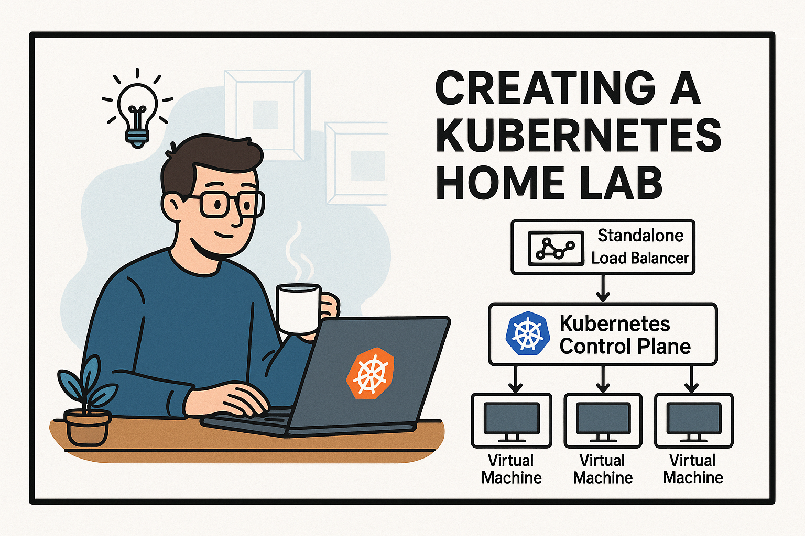

This article series documents my interest creating a Kubernetes "home-lab" for research and experiementation. It will consist of a mix of virtual machines running the Kubernetes control plan, a standalone front end load balancer, and multiple agents.  I'll then illustrate creating and deploying a Rust based sample app running in the cluster.  My tutorial assumes the use of Ubuntu 24.04 Desktop and a system with 64GB of RAM and at least 16 CPU cores.

* [Part 1: Setting up OpenvSwitch Networking](PART1_OpenvSwitch.md)
* [Part 2: Setting up KVM for k8s nodes and load balancer](PART2_Setting_Up_KVM.md)
* Part 3: Adding VM based Kubernetes Agents (coming soon)
* Part 4: Creating and Deploying a Rust based Sample App (coming soon)
